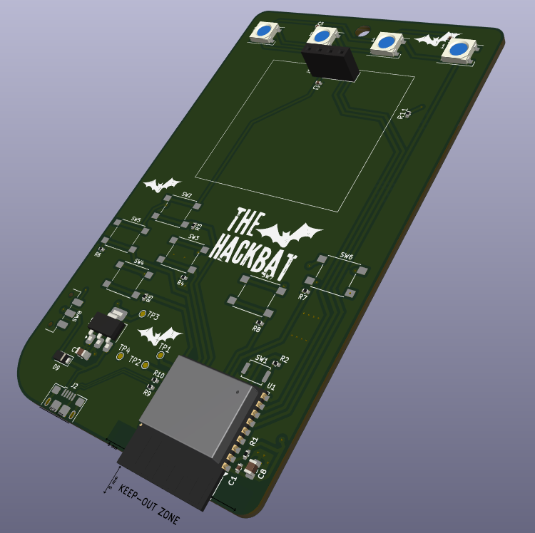

# DEFCON32 Badge

The Hackbat BAdge has been designed specially for DEFCON32. This badge features the ESP32C3 microcontroller with WIFI and Bluetooth. The board also has LEDs, and an OLED Display to show information.

If you received your badge at DEFCON, read [this](#Did-you-receive-your-Hackbat-Badge-at-DEFCON32?)!!

## Microcontroller
The microcontroller used in the Hackbat Badge is the [ESP32-C3](https://www.espressif.com/sites/default/files/documentation/esp32-c3_datasheet_en.pdf) from Espressif. The format used is the WROOM. This microcontroller features a RISC-V single-core processor, WIFI at 2.4GHz IEEE 802.11b/g/n-compliant, Bluetooth LE 5.0, and a bunch of peripherals like SPI, I2C, UART...

This microcontroller can be programmed using either the Arduino IDE or the official [ESP-IDF](https://idf.espressif.com/).

## LEDs

LED are a must in any badge. The Hackbat Badge has 4 smart LEDs, the WS2812. This LED hs a controller integrated so you can choos the color using a serial protocol. The best of these LED is that you can conenct many of them in series, and send different commands to each one. 

## Layout

The layout of the board is designed to looks like an old GAMEBOY, havning 6 push-buttons, and the OLED display. The microcontroller is located in the bottom part of the board, like the USB connector. The backside of the Badge is reserved for a case with three AA cells.

## Did you receive your Hackbat Badge at DEFCON32?

This board have been designed in 2 days to be sure that it will be ready for DEFCON32, but in many cases being the designs fast means errors. If you recevived your Hackbat Badge at DEFCON, the diode D9 is not in its correct place. This diode keep the battery disconnected when the USB is connected, but in the first version of the board this diode is placed in the battery USB side, so since the 5V of the USb are greater than the 4.5 volts of the battery, the USB is conencted directly to the battery. This version have this issue fixed.

## Get Yours

The HackBat Badge is open-source, so you can use the output files to manufacture your own in [JLCPCB](https://jlcpcb.com/?from=controlpath). You just need to compress the `production_files` directory, and upload it to [JLCPCB](https://jlcpcb.com/?from=controlpath). 

Remember to change the Surface Finish to **LeadFree HASL** to make your board ROHS compliant. Also, the original board uses a Black PCB color, so if you want to keep your Hackbat like the original, you can select this color to be sure that the silkscreen is seen correctly.

Then you have to add the PCB Assembly service and upload the [centroid](./kicad/production_files/defcon32_badge-top-pos.csv) file, and the [BOM](./kicad/production_files/bom.csv). 

In a few days, you will receive your board at home.
